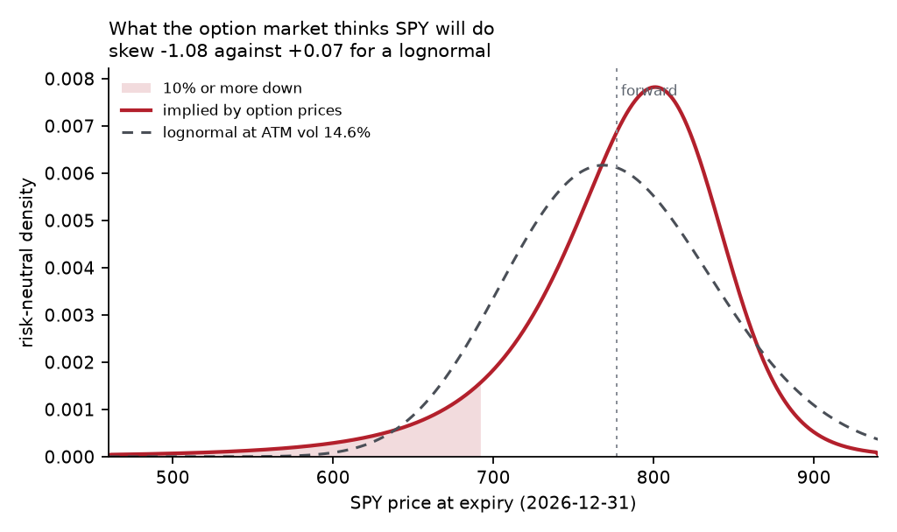

# ImpliedDensity

Option prices contain a probability distribution. Breeden-Litzenberger says the
risk-neutral density of the underlying at expiry is the second derivative of the
call price with respect to strike:

```
q(K) = e^{rT} · ∂²C/∂K²
```

The intuition is a butterfly spread — buy a call either side of a strike, sell
two in the middle — which pays out only if the price lands near that strike. Its
cost is what the market charges for that outcome, so it *is* the probability.

This reads that distribution off a live chain, and takes seriously the reason it
is hard.

## What it found

Fitted to <<n_quotes>> two-sided <<symbol>> call quotes on <<asof>>, spot
<<spot>>, expiring <<expiry>> (<<days>> days, T = <<tau>> years):

| | implied by the market | lognormal at ATM vol <<atm_vol>> |
|---|---|---|
| skew | **<<skew>>** | <<ln_skew>> |
| excess kurtosis | **<<kurt>>** | <<ln_kurt>> |
| P(down 10% or more) | <<p10>> | <<ln_p10>> |
| P(down 20% or more) | **<<p20>>** | <<ln_p20>> |

The market's distribution is nothing like the Black-Scholes bell. It is strongly
left-skewed, and it prices a 20% drawdown as **<<p20_ratio>> times** more likely
than a lognormal at the same at-the-money volatility. That gap is the crash risk
the smile is pricing, expressed as a probability rather than a vol number.



## The hard part, and the fix

A second derivative amplifies noise. Interpolating quoted implied vols with a
cubic spline and differentiating gives a curve with **negative regions** — which
is not a probability density, it is a butterfly arbitrage: a portfolio with a
non-negative payoff priced below zero.

Measured on this chain, the spline approach put <<spline_neg>>% of the density's
mass below zero before clipping. Two things that did *not* fix it:

- **Smoothing the smile** made it worse (16% → 32% negative mass); a moving
  average distorts exactly the curvature the density is made of.
- **Truncating to liquid strikes** made it worse too, and destroyed the result:
  restricting to 0.8–1.2 moneyness drove P(down 20%) to zero, which is an
  artefact of cutting off the tail rather than a finding about it.

What works is constraining the *shape* of the smile rather than filtering the
data. Fitting Gatheral's SVI parameterisation in total-variance space,

```
w(k) = a + b·( ρ(k−m) + √((k−m)² + σ²) ),    k = log(K/F)
```

absorbs quote noise into a five-parameter fit instead of into the curvature. On
this chain that removes the problem completely:

| | negative mass | mean vs forward | butterfly arbitrage-free |
|---|---|---|---|
| cubic spline | <<spline_neg>>% | <<spline_mean_err>> | no |
| **SVI** | **<<svi_neg>>%** | **<<svi_mean_err>>** | **yes** (min g(k) = <<gmin>>) |

with a volatility fit RMSE of <<rmse>>. The arbitrage check is Gatheral and
Jacquier's g(k) ≥ 0 condition, evaluated across the grid, so the output is
*verified* non-negative rather than clipped into looking non-negative.

## Running it

Requires `numpy` and `scipy` (`matplotlib` only for the figure).

```
python analyse.py                  # cached chain, SVI fit
python analyse.py --refresh        # pull a fresh chain from Cboe
python analyse.py --method spline  # the naive version, to see the problem
python -m unittest discover -s tests -v
```

Quotes come from Cboe's public delayed-quote endpoint — no key, no scraping.
Yahoo's option endpoint now returns 401 without a session crumb and is not used.

## Tests

<<n_tests>> tests, offline and deterministic. The important one is a round trip:
price a synthetic chain at a known constant volatility, run the full estimator
over those prices, and require the recovered density to match the analytic
lognormal to within 5% of peak. An estimator that cannot recover a density it
was handed is not one to point at a real chain.

Others worth naming:

- put-call parity, no-arbitrage price bounds, monotonicity in strike and in vol
- implied-vol inversion round trip across strikes and vol levels, and NaN rather
  than a boundary value when a price is outside the no-arbitrage band
- SVI recovers its own parameters from synthetic data, and fits a flat smile as
  constant variance
- a downward-sloping smile must produce a left-skewed density with a fatter
  **far** tail — asserted below 65, 70 and 75 on a spot of 100, and deliberately
  not at 80, where the comparison reverses because skew shifts the bulk right as
  well as stretching the tail

## Layout

| file | purpose |
|---|---|
| `src/implieddensity/blackscholes.py` | pricing, vega, implied vol by bisection |
| `src/implieddensity/svi.py` | SVI fit and the g(k) arbitrage check |
| `src/implieddensity/density.py` | Breeden-Litzenberger, both smile fitters |
| `src/implieddensity/chain.py` | Cboe chain fetch, OCC symbol parsing, caching |
| `analyse.py` | end-to-end run, writes `results.json` and `density.png` |
| `make_readme.py` | renders this file from `results.json` |

## A note on the numbers

Every figure above is injected from `results.json` by `make_readme.py`, which
fails if a value is missing. Re-running the analysis and regenerating keeps the
text and the data in step; nothing here is transcribed by hand.

## Reference

Figlewski, *Risk Neutral Densities: A Review*, NYU Stern.
Gatheral & Jacquier, *Arbitrage-free SVI volatility surfaces*.

Not investment advice. Delayed quotes, a fixed assumed rate and dividend yield,
and a single expiry: this measures what a chain implies, it does not forecast.
